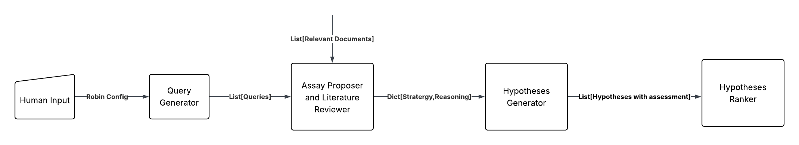

## Mini Robin

This repo contains the partial implementation of the Robin Multi-Agent Framework, until the first loop of assay generation 
and ranking assays. 

**Given Input** : {Topic, No. of Queries, No. of Assays}.

**Expected Output**: Ranked Assays containing the final winner  (with choice of ranking method).

### WorkFlow of Mini Robin: 
Implementation of the first loop of until ranking assays

### Ranking Methods:
1. **Bradley-Terry-Luce (BTL)**: This method is used in the original Robin repo for ranking.
2. **Elo Rating**: This method is used in AI co-scientist.

### Implementation Details:

1. I have implemented Crow agent without using the original robin repo implementation code. (Although I have used their prompts).
2. I have used high level code of CrewAI so that, I can focus more on task architecture, agent behavior and the final output instead of
   the implementation details of building connection between the agents. CrewAI takes care of the sequential flow of tasks directly from YAML files
3. Added another ranking method, Elo Rating, to the existing BTL ranking method.

### Issues with output at the moment:
1. The order in which the pair is presented to the ranker, leads to bias of the winner and loser. The first assay in the json file, seems
to be the winner and the second is the loser. This is not good. I have fixed this with prompting for now. The prompt also leads to inverse bias.
2. When I run the input topic like "glaucoma", the hypothesis generated and the winner assay seems to be the same, acting 
 deterministically. Not sure if this is good or bad.

### TODOs:
1. Use different Language Models for query generation, hypotheses generation and assay ranking.
2. Add the knowledge base tool to Query Generator and Hypotheses Generator agents.
3. Analyze the output thoroughly.

